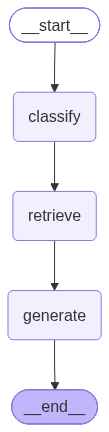
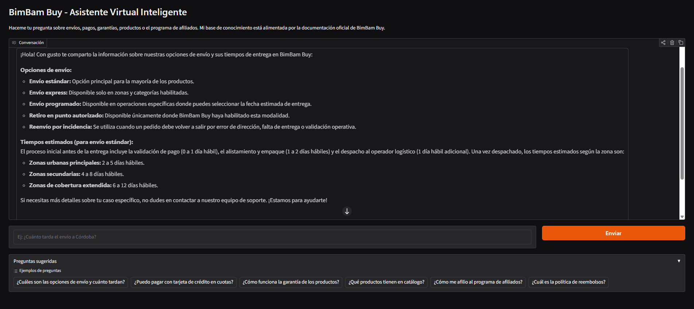

# BimBam Buy - Agente Virtual Inteligente

Agente conversacional RAG (Retrieval-Augmented Generation) que responde preguntas de clientes de **BimBam Buy** utilizando la documentación oficial como base de conocimiento.

## Arquitectura

```
┌─────────────────────────────────────────────────────────┐
│                  Interfaz Gradio                        │
│         (chat + streaming + preguntas sugeridas)        │
└──────────────────────┬──────────────────────────────────┘
                       │
                       ▼
┌─────────────────────────────────────────────────────────┐
│              Grafo LangGraph (agent.py)                 │
│                                                         │
│  ┌──────────┐   ┌──────────┐   ┌──────────────┐         │
│  │ classify │──▶│ retrieve │──▶│   generate   │         │
│  │(keywords)│   │  (FAISS) │   │  (Gemini)    │         │
│  └──────────┘   └──────────┘   └──────────────┘         │
│       │              │                │                 │
│       ▼              ▼                ▼                 │
│  Clasifica      Busca docs      Genera la               │
│  por keywords   en paralelo     respuesta (streaming)   │
│  (instantáneo)                                          │
└─────────────────────────────────────────────────────────┘
                       │
                       ▼
┌─────────────────────────────────────────────────────────┐
│           Vector Store FAISS (knowledge_base.py)        │
│                                                         │
│  Embeddings: Gemini gemini-embedding-001                │
│  Fuentes:                                               │
│   ├── 5 PDFs (Docs/)                                    │
│   │   ├── Política de Reembolsos                        │
│   │   ├── Programa de Afiliados                         │
│   │   ├── Guía de Tiempos y Costos de Envío             │
│   │   ├── Preguntas Frecuentes sobre Pagos              │
│   │   └── Manual de Garantía                            │
│   └── CSV (data/catalogo_productos.csv)                 │
│       └── Catálogo de 15 productos                      │
└─────────────────────────────────────────────────────────┘
```

## Flujo de ejecución



1. El cliente escribe una pregunta en la interfaz Gradio
2. El nodo **classify** clasifica la pregunta por palabras clave en: envíos, pagos, garantía, productos, afiliados o general (sin llamada a LLM)
3. El nodo **retrieve** recupera los chunks más relevantes del vector store FAISS de forma paralela
4. El nodo **generate** (Gemini) genera una respuesta streaming usando el contexto recuperado
5. La respuesta se muestra token por token al cliente

## Tecnologías

| Componente | Tecnología |
|------------|------------|
| Orquestación | LangGraph |
| LLM | Google Gemini 3.5 Flash Lite |
| Embeddings | Gemini gemini-embedding-001 |
| Vector Store | FAISS (local) |
| Interfaz | Gradio |
| Framework | LangChain |

## Instalación

```bash
# Clonar el repositorio
git clone https://github.com/tu-usuario/bimbambuy-agent.git
cd bimbambuy-agent

# Crear entorno virtual
python -m venv venv
venv\Scripts\activate        # Windows
# source venv/bin/activate   # Linux/Mac

# Instalar dependencias
pip install -r requirements.txt

# Configurar variables de entorno
# Editar .env y colocar tu GEMINI_API_KEY
```

## Uso

```bash
# Ejecutar la aplicación
python app.py
```

Abrir http://localhost:7860 en el navegador.

### Ver el grafo del agente

```bash
python agent.py
```

Genera un archivo `graph.png` con la visualización del grafo LangGraph.

### Ejecutar tests de ejemplo

```bash
python -c "from agent import run_tests; run_tests()"
```

### Primera ejecución

En la primera ejecución, el sistema:
1. Lee los 5 PDFs de la carpeta `Docs/`
2. Lee el CSV de la carpeta `data/`
3. Genera los chunks de texto (500 caracteres)
4. Calcula los embeddings con Gemini
5. Crea el índice FAISS en la carpeta `faiss_index/`

Las siguientes ejecuciones cargan el índice pre-computado.

## Ejemplos de preguntas y respuestas

| Pregunta | Categoría |
|---|---|
| ¿Cuánto tarda el envío a Buenos Aires? | Envíos |
| ¿Puedo pagar con Mercado Pago? | Pagos |
| ¿Cuánto dura la garantía? | Garantía |
| ¿Qué productos tienen? | Productos |
| ¿Cómo me afilio? | Afiliados |

### Ejemplo 1: Envíos

**Pregunta:** ¿Cuánto tarda el envío a Buenos Aires?

**Categoría detectada:** Envíos

**Respuesta:** Los tiempos de entrega estimados una vez que el pedido es despachado son:
- **Zonas urbanas principales:** 2 a 5 días hábiles
- **Zonas secundarias:** 4 a 8 días hábiles
- **Zonas de cobertura extendida:** 6 a 12 días hábiles

Adicionalmente, los tiempos de preparación del pedido antes de su envío son:
- **Validación de pago:** 0 a 1 día hábil
- **Alistamiento y empaque:** 1 a 2 días hábiles
- **Despacho al operador logístico:** 1 día hábil adicional

### Ejemplo 2: Pagos

**Pregunta:** ¿Puedo pagar con Mercado Pago?

**Categoría detectada:** Pagos

**Respuesta:** En BimBam Buy aceptamos billeteras digitales disponibles por país (además de tarjetas de crédito y débito, transferencias bancarias, pagos en efectivo en puntos habilitados y financiamiento). Te sugerimos revisar directamente el checkout al momento de realizar tu compra; si la opción no aparece allí, significa que no está habilitada para ese pedido.

### Ejemplo 3: Garantía

**Pregunta:** ¿Cuánto dura la garantía?

**Categoría detectada:** Garantía

**Respuesta:** El plazo de la garantía puede variar según el tipo de producto, la categoría y el país. El plazo específico aplicable para tu caso será el que se encuentre informado en la ficha del producto o en tu confirmación de compra. En caso de que exista alguna diferencia entre los documentos, siempre prevalecerá la información específica del producto y la normativa local aplicable.

## Estructura del proyecto

```
├── Docs/                          # Documentación PDF de BimBam Buy
│   ├── Política de Reembolsos.pdf
│   ├── Programa de Afiliados.pdf
│   ├── Guía de Tiempos y Costos de Envío.pdf
│   ├── Preguntas Frecuentes.pdf
│   └── Manual de Garantía.pdf
├── data/
│   └── catalogo_productos.csv     # Catálogo de productos (15 items)
├── faiss_index/                   # Índice FAISS (generado automáticamente)
├── knowledge_base.py              # Carga y procesamiento de documentos → Vector Store
├── agent.py                       # Grafo LangGraph (classify → retrieve → generate)
├── app.py                         # Interfaz Gradio con streaming
├── graph.png                      # Visualización del grafo (generado con python agent.py)
├── requirements.txt               # Dependencias
├── .env                           # Variables de entorno (GEMINI_API_KEY)
└── README.md                      # Este archivo
```

## Conceptos aplicados

- **LangGraph**: Orquestación del agente con grafo de estados (StateGraph)
- **RAG (Retrieval-Augmented Generation)**: Recuperación de contexto relevante antes de generar respuestas
- **Embeddings**: Representación vectorial del contenido para búsqueda semántica
- **Vector Store (FAISS)**: Almacenamiento y búsqueda de similitud de documentos
- **Clasificación por keywords**: Enrutamiento rápido basado en reglas (sin LLM)
- **Streaming**: Respuestas token por token para mejor percepción de velocidad
- **Caché**: Almacenamiento de respuestas para preguntas repetidas
- **Concurrencia**: Búsquedas FAISS paralelas con ThreadPoolExecutor
- **Prompt Engineering**: Prompts especializados para generación de respuestas

## Variables de entorno

| Variable | Descripción | Obtener en |
|---|---|---|
| `GEMINI_API_KEY` | API key de Google Gemini | [Google AI Studio](https://aistudio.google.com/apikey) |

## Deploy

**URL:** [https://bimbambuy-agent.onrender.com](https://bimbambuy-agent.onrender.com/)



Deployado en [Render](https://render.com) (Free Tier).
